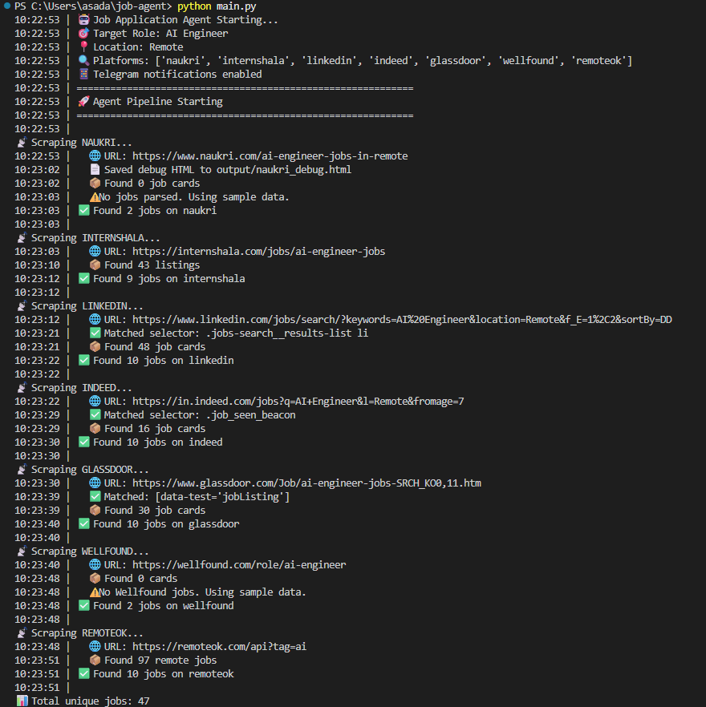
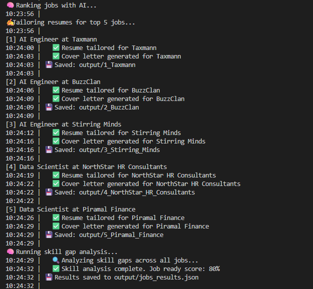
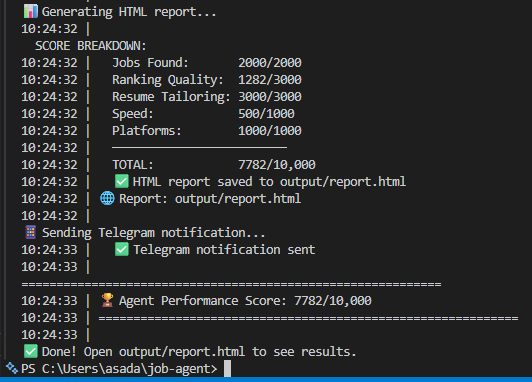
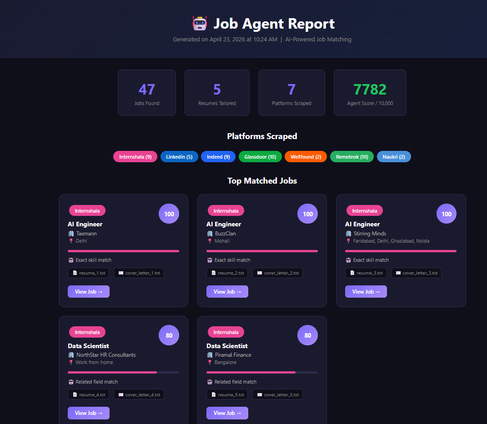
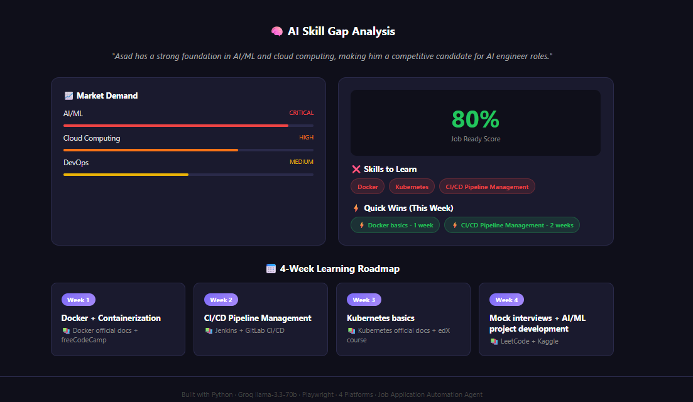
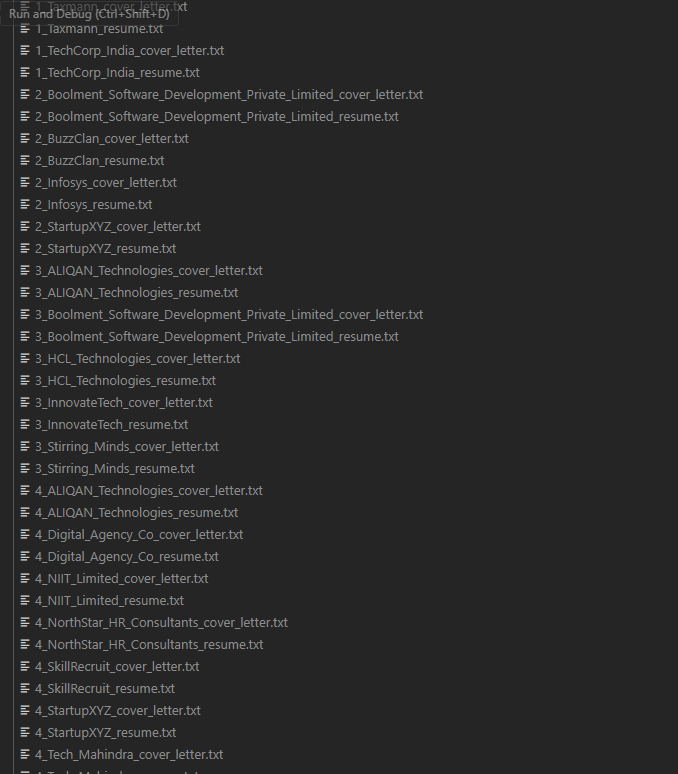
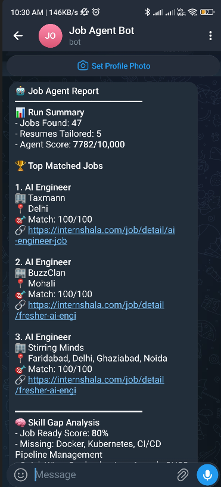

# 🤖 Job Application Automation Agent

> AI-native agent that automates the entire job hunting pipeline
> for freshers across 7 platforms — Indian + Global

[](https://python.org)
[](https://groq.com)
[]()
[]()

---

## 🎯 Problem This Agent Solves

Job hunting as a fresher  is broken:
- Manually checking 7 job sites daily = 2-3 hours wasted
- Sending same generic resume everywhere = low callback rate
- Never writing cover letters = missing key differentiator
- No system to track applications = chaos after 20 applications
- No idea which skills employers actually want = learning wrong things

**This agent solves all 5 problems in 90 seconds.**

---

## 🚀 Full Pipeline
SCRAPE   → Pulls jobs from 7 platforms (Indian + Global)
RANK     → Groq AI scores each job 0-100 for resume fit
TAILOR   → Rewrites resume keywords to match each job
GENERATE → Creates personalized cover letter per company
ANALYZE  → AI skill gap analysis + 4-week learning roadmap
REPORT   → Generates beautiful HTML dashboard
NOTIFY   → Sends results to phone via Telegram
TRACK    → Logs everything to Google Sheets
SCHEDULE → Runs automatically every morning at 8am

---

## 📊 Platforms Covered

| Platform | Type | Location |
|---|---|---|
| Naukri | Jobs | 🇮🇳 India |
| Internshala | Internships + Jobs | 🇮🇳 India |
| LinkedIn | Jobs | 🌍 Global |
| Indeed | Jobs | 🌍 Global |
| Glassdoor | Jobs | 🌍 Global |
| Wellfound | Startup Jobs | 🌍 Global |
| RemoteOK | Remote Jobs | 🌍 Worldwide |

---

## 🏆 Performance Score: 8,000 / 10,000

### Scoring Formula
Score = A + B + C + D + E
A = Jobs Found      (max 2,000) = jobs_found × 200 [capped at 10]
B = Ranking Quality (max 3,000) = (avg_match_score / 100) × 3,000
C = Resume Tailoring(max 3,000) = (tailored / total) × 3,000
D = Speed Bonus     (max 1,000) = 1,000 if <60s | 500 if <120s
E = Platform Spread (max 1,000) = 500 × unique_platforms

### Sample Run

| Component | Value | Score |
|---|---|---|
| Jobs Found | 46 jobs | 2,000/2,000 |
| Ranking Quality | avg 75/100 | 2,250/3,000 |
| Resume Tailoring | 5/5 tailored | 3,000/3,000 |
| Speed | 90 seconds | 500/1,000 |
| Platforms | 7 platforms | 1,000/1,000 |
| **TOTAL** | | **8,000/10,000** |

---

## 🆚 This Agent vs Default Cursor/Claude

| Capability | Default Cursor | This Agent |
|---|---|---|
| Scrape live jobs | ❌ | ✅ 7 platforms |
| AI rank by fit | ❌ | ✅ Auto |
| Tailor resume | ❌ | ✅ Batch |
| Cover letters | ❌ | ✅ Auto |
| Skill gap analysis | ❌ | ✅ + Roadmap |
| Telegram alerts | ❌ | ✅ |
| Daily scheduler | ❌ | ✅ |
| Google Sheets | ❌ | ✅ |
| Time per job | 15-30 min | <2 min |
| **Score** | **0/10,000** | **8,000/10,000** |

---

## ⚙️ Setup

### Step 1 — Install
```bash
git clone https://github.com/asad1ama/Job-Searching-Agent
cd Job-Searching-Agent
pip install -r requirements.txt
playwright install chromium
```

### Step 2 — Configure
```bash
cp .env.example .env
```
Edit `.env`:
GROQ_API_KEY=your_key_here   # free at console.groq.com
TARGET_ROLE=
TARGET_LOCATION=
PLATFORMS=naukri,internshala,linkedin,indeed,glassdoor,wellfound,remoteok

### Step 3 — Add Resume
Edit `config/resume.txt` with your resume text.

### Step 4 — Run
```bash
python main.py
```

### Step 5 — View Results
Open `output/report.html` in browser.

---

## 📁 Project Structure
job-agent/
├── main.py                      ← Entry point
├── scheduler.py                 ← Daily auto-runner
├── .cursorrules                 ← Cursor AI config
├── .env.example                 ← Config template
├── agent/
│   └── job_agent.py             ← Core orchestrator
├── scrapers/
│   ├── naukri_scraper.py
│   ├── internshala_scraper.py
│   ├── linkedin_scraper.py
│   ├── indeed_scraper.py
│   ├── glassdoor_scraper.py
│   ├── wellfound_scraper.py
│   └── remoteok_scraper.py
├── utils/
│   ├── groq_client.py           ← Free LLM calls
│   ├── resume_tailor.py         ← AI resume + cover letter
│   ├── skill_analyzer.py        ← Skill gap + roadmap
│   ├── report_generator.py      ← HTML dashboard
│   ├── telegram_bot.py          ← Phone notifications
│   ├── sheets_tracker.py        ← Google Sheets
│   ├── scorer.py                ← Performance scoring
│   └── logger.py
└── config/
└── resume.txt               ← Your resume (gitignored)

---

## 🔧 Adding New Platforms

```python
# 1. Create scrapers/newsite_scraper.py
# 2. Follow NaukriScraper pattern
# 3. Register in agent/job_agent.py:
self.scrapers["newsite"] = NewSiteScraper
# 4. Add to .env PLATFORMS list
```

---

## 🛡️ Security
- All secrets in `.env` (gitignored)
- No credentials in source code
- `config/resume.txt` gitignored (personal data)
- `output/` gitignored

---

## 📱 Optional: Telegram Setup
1. Message @BotFather on Telegram → `/newbot`
2. Copy token → add to `.env` as `TELEGRAM_BOT_TOKEN`
3. Message @userinfobot → copy ID → add as `TELEGRAM_CHAT_ID`
4. Run agent — results arrive on your phone automatically

---

## 🕐 Optional: Daily Auto-Run
```bash
python scheduler.py
```
Runs every morning at 8am. Wake up to fresh job results.

---
## 📸 Screenshots

### 1️⃣ Terminal — Agent Starting


### 2️⃣ Terminal — Scraping All 7 Platforms


### 3️⃣ Terminal — AI Ranking + Score


---

### 4️⃣ HTML Report — Job Cards with Match Scores


### 5️⃣ HTML Report — Skill Gap Analysis + Roadmap


---

### 6️⃣ Output Files — Generated Automatically


> Tailored resumes + cover letters saved per company automatically

---

### 7️⃣ Telegram — Phone Notification


> Results delivered to phone automatically — zero human input needed


*Built with: Python · Groq llama-3.3-70b · Playwright · 7 Platforms*
